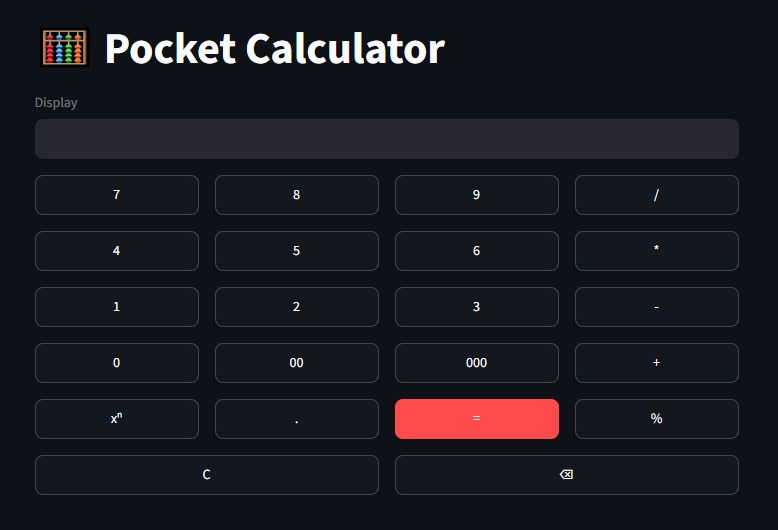

# 🧮 Pocket Calculator

<div align="center">


### A modern pocket calculator built with **Python** and **Streamlit**

Simple, responsive, and interactive—designed to resemble a traditional handheld calculator while demonstrating Streamlit's UI capabilities.

</div>

---

## 🌐 Live Demo

🚀 **Use my Calculator here**

**https://akbmfflbc5gn26m9y7h7nk.streamlit.app**
## ✨ Features

### 🔢 Basic Operations

- ➕ Addition
- ➖ Subtraction
- ✖️ Multiplication
- ➗ Division

### 🚀 Advanced Operations

- 🧮 Power (`xⁿ`)
- 📐 Modulus / Remainder (`%`)

### ⚙️ Utility Features

- 🔢 Number Buttons (`0–9`)
- 💯 Quick Entry Buttons (`00`, `000`)
- 🔘 Decimal Support (`.`)
- 🟰 Expression Evaluation (`=`)
- 🧹 Clear Display (`C`)
- ⌫ Backspace
- ⚡ Instant UI updates using Streamlit Session State
- 📱 Responsive calculator layout

---

## 📸 Preview

<div align="center">



</div>

# 🚀 Installation

## Clone the Repository

```bash
git clone https://github.com/A6dur/Pocket-Calculator.git
```

## Navigate to the Project

```bash
cd Pocket-Calculator
```

## Install Dependencies

```bash
pip install streamlit
```

## Run the Application

```bash
streamlit run calculator.py
```

Your browser will automatically open the calculator.

---

# 📂 Project Structure

```
Pocket-Calculator/
│
├── calculator.py
├── README.md
└── requirements.txt
```

---

# 🛠 Technologies Used

- 🐍 Python
- 🎈 Streamlit
- 🔄 Streamlit Session State

---

# ⚙️ How It Works

The calculator stores the current mathematical expression inside **Streamlit Session State**.

Each button press:

- Appends the selected value to the expression.
- Instantly refreshes the interface.
- Preserves the current expression.
- Evaluates the expression when **=** is pressed.

The calculator uses Python's expression evaluation to perform calculations while maintaining a simple and interactive interface.

---

# 📋 Supported Operators

| Button | Operation |
|--------|-----------|
| `+` | Addition |
| `-` | Subtraction |
| `*` | Multiplication |
| `/` | Division |
| `%` | Remainder (Modulus) |
| `xⁿ` | Exponent / Power |
| `.` | Decimal Point |
| `00` | Double Zero |
| `000` | Triple Zero |
| `⌫` | Delete Last Character |
| `C` | Clear Display |

---

# 💡 Example Calculations

| Expression | Result |
|------------|--------|
| `15+20` | `35` |
| `18%5` | `3` |
| `2**8` *(xⁿ)* | `256` |
| `45/9` | `5` |
| `7*8` | `56` |

---

# 🎯 Future Improvements

- [ ] Scientific Calculator Mode
- [ ] Parentheses `(` `)`
- [ ] Square Root (√)
- [ ] Trigonometric Functions
- [ ] Logarithmic Functions
- [ ] Memory Operations (M+, M-, MR, MC)
- [ ] Keyboard Support
- [ ] Calculation History
- [ ] Dark / Light Theme Toggle
- [ ] Better Error Messages

---

# 🤝 Contributing

Contributions are welcome!

1. Fork this repository.
2. Create a new feature branch.

```bash
git checkout -b feature/your-feature
```

3. Commit your changes.

```bash
git commit -m "Add new feature"
```

4. Push your branch.

```bash
git push origin feature/your-feature
```

5. Open a Pull Request.

---

# ⭐ Support the Project

If you found this project helpful, consider giving it a **⭐ Star** on GitHub.

It helps others discover the project and motivates future improvements.

---

<div align="center">

### 💻 Made with ❤️ using Python & Streamlit

**Thanks for visiting! Happy Coding! 🚀**

</div>